<!-- Preencher, se necessário: instituição, disciplina e professor(a) -->

<div align="center">

# Análise de Sentimentos em Avaliações da Amazon

### Mini-projeto de Processamento de Linguagem Natural — AV1

<br>

**Dataset:** Amazon Reviews for Sentiment Analysis

**Equipe:** Kevin Marcos e Ricardinho Borogodó

<br>

Outubro de 2026

</div>

---

## Sumário

1. Introdução
2. Pré-processamento e limpeza textual
3. Análise exploratória do corpus
4. Construção dos modelos de classificação
5. Avaliação quantitativa dos resultados
6. Conclusão
7. Referências

---

## 1. Introdução

### 1.1 Objetivo

Este trabalho conduz um mini-projeto completo de Processamento de Linguagem Natural (PLN) sobre avaliações de produtos da Amazon escritas em inglês. A tarefa é a **classificação binária de sentimento** (avaliação negativa ou positiva) e passa por pré-processamento, análise exploratória com aprendizado não supervisionado, treinamento de classificadores e avaliação quantitativa.

### 1.2 Dataset

O *Amazon Reviews for Sentiment Analysis* (Kaggle) é uma versão em formato fastText do conjunto *Amazon Review Polarity* de Zhang, Zhao e LeCun (2015). Cada linha contém um rótulo seguido do título e do corpo da avaliação, separados por dois-pontos:

```text
__label__2 Stuning even for the non-gamer: This sound track was beautiful! It paints the senery ...
```

| Rótulo | Classe | Origem |
|---|---|---|
| `__label__1` | negativo (0) | avaliações de 1 e 2 estrelas |
| `__label__2` | positivo (1) | avaliações de 4 e 5 estrelas |

As avaliações de 3 estrelas (neutras) foram excluídas pelos autores do conjunto original. A partição de treino e teste já vem definida: **3.600.000 documentos de treino** (1,6 GB) e **400.000 de teste** (177 MB). As avaliações cobrem várias categorias de produto (livros, música, filmes, eletrônicos, jogos etc.), e o texto é informal, com muitos erros de digitação.

---

## 2. Pré-processamento e limpeza textual

### 2.1 Etapas adotadas

O pré-processamento é aplicado de forma idêntica ao treino e ao teste, na ordem abaixo.

| # | Etapa | Implementação | Justificativa |
|---|---|---|---|
| 1 | Separação de rótulo e texto | `__label__1` → negativo, `__label__2` → positivo. Título e corpo são mantidos juntos. | O título costuma concentrar a opinião ("TERRIBLE!! DO NOT BUY THIS"), por isso foi preservado. |
| 2 | Normalização | Conversão para minúsculas. | Unifica "Great", "GREAT" e "great" em um único termo. |
| 3 | Remoção de ruído | Mantêm-se apenas letras e espaços (`str.isalpha`): saem pontuação, dígitos, símbolos e emoticons. | Em BoW/TF-IDF, pontuação e números (preços, anos, modelos de produto) quase não carregam polaridade e inflam o vocabulário. |
| 4 | Tokenização | `word_tokenize` (NLTK). | Tokenizador padrão para inglês. |
| 5 | Etiquetagem gramatical | `pos_tag_sents` (Perceptron do NLTK), aplicado à frase completa. | A classe gramatical é necessária para lematizar corretamente. A etiquetagem é feita **antes** da remoção de stopwords porque o tagger depende do contexto da frase inteira. |
| 6 | Remoção de stopwords | Lista de stopwords do NLTK para inglês. | Remove palavras funcionais muito frequentes e pouco informativas (artigos, preposições, pronomes). |
| 7 | Lematização | `WordNetLemmatizer` com a classe gramatical mapeada: adjetivo (`J`), verbo (`V`), advérbio (`R`); as demais etiquetas são tratadas como substantivo. | Reduz flexões à forma de dicionário. Verbos vão para o infinitivo, inclusive os irregulares. |

**Lematização *versus* stemming.** Optou-se pela lematização porque ela produz palavras reais, o que mantém interpretáveis as nuvens de palavras, os termos de cada tópico e os pesos dos modelos. Com a classe gramatical, o WordNet trata verbos irregulares ("bought" → "buy", "told" → "tell", "got" → "get"), algo que um *stemmer* como o de Porter não faz ("bought" continuaria "bought") e que ainda geraria radicais artificiais ("stories" → "stori"). Sem a classe gramatical, o lematizador trataria tudo como substantivo, e formas como "loved" ou "visiting" ficariam inalteradas.

**Desbalanceamento.** Não foi necessário nenhum tratamento: as duas classes têm exatamente 50% dos documentos tanto no treino quanto no teste (Seção 3.2). Por isso não houve reamostragem nem pesos por classe, e a acurácia é uma métrica informativa. Ainda assim, a validação cruzada dos modelos usa partições estratificadas e F1 macro.

### 2.2 Exemplos

A Tabela 1 mostra três avaliações do treino antes e depois do pré-processamento. Os exemplos completos estão em `assets/model_inputs/example/documentos.csv`.

*Tabela 1 — Exemplos de documentos antes e depois do pré-processamento.*

| Classe | Texto original | Texto pré-processado |
|---|---|---|
| positivo | Alaska sourdough: REad most of the book while visiting my brother in Alaska. Loved it. I am going to be making my sourdough starter soon. Book is full of great stories and recipes. | alaska sourdough read book visit brother alaska love go make sourdough starter soon book full great story recipe |
| negativo | Doesn't work on a Mac: It clearly says on line this will work on a Mac OS system. The disk comes and it does not, only Windows . Do Not order this if you have a Mac!!!!!!! | doesnt work mac clearly say line work mac o system disk come windows order mac |
| negativo | TERRIBLE!! DO NOT BUY THIS: I bought this for my wife for her birthday,and had toreturn it because the DVD palyer would not work. [...] It is a piece of junk. | terrible buy buy wife birthdayand toreturn dvd palyer would work return get repalcement dvd player fail work piece junk |

No primeiro exemplo, a lematização funciona como esperado: "visiting" → "visit", "Loved" → "love", "going" → "go", "making" → "make", "stories" → "story".

### 2.3 Aspectos computacionais

O volume do corpus exigiu algumas decisões de implementação:

- **Leitura em blocos.** Os arquivos são lidos em blocos de 7.562 linhas, sem carregar o corpus inteiro na memória.
- **Paralelismo.** A etiquetagem gramatical é, de longe, a etapa mais cara. Por isso os blocos são processados em paralelo com `multiprocessing` (10 processos, deixando 2 núcleos livres).
- **Ordem das linhas.** O resultado é gravado na mesma ordem do arquivo original, o que permite associar cada documento processado ao seu texto original na análise de erros (Seção 5).
- **Tempo de execução.** O pré-processamento completo (treino e teste) levou cerca de 41 minutos.

---

## 3. Análise exploratória do corpus

Todas as estatísticas desta seção são calculadas sobre o texto já pré-processado. Os gráficos e as tabelas com os dados correspondentes estão em `outputs/eda/` e `outputs/eda_with_models/`.

### 3.1 Tamanho do corpus e número de classes

O corpus possui **2 classes** (negativo e positivo) e **4 milhões de documentos**, com mais de 160 milhões de tokens após o pré-processamento.

*Tabela 2 — Resumo do corpus após o pré-processamento.*

| Partição | Classe | Documentos | Tokens | Vocabulário | Média de tokens/doc | Mediana | Máximo | Hapax |
|---|---|---:|---:|---:|---:|---:|---:|---:|
| Treino | negativo | 1.800.000 | 74.263.248 | 1.253.924 | 41,26 | 37 | 185 | 873.512 |
| Treino | positivo | 1.800.000 | 70.042.502 | 1.306.120 | 38,91 | 34 | 183 | 915.684 |
| Treino | **total** | **3.600.000** | **144.305.750** | **2.141.606** | **40,08** | **36** | **185** | **1.504.191** |
| Teste | negativo | 200.000 | 8.245.262 | 266.199 | 41,23 | 37 | 164 | 180.598 |
| Teste | positivo | 200.000 | 7.785.002 | 274.140 | 38,93 | 34 | 161 | 185.147 |
| Teste | **total** | **400.000** | **16.030.264** | **446.871** | **40,08** | **36** | **164** | **308.124** |

*Hapax* são palavras que ocorrem uma única vez no conjunto. Os documentos são curtos (cerca de 40 tokens em média), e o teste reproduz fielmente as estatísticas do treino: mesma média, mesma mediana e mesma proporção de classes. Isso indica que não há mudança de distribuição entre as partições.

### 3.2 Distribuição de classes

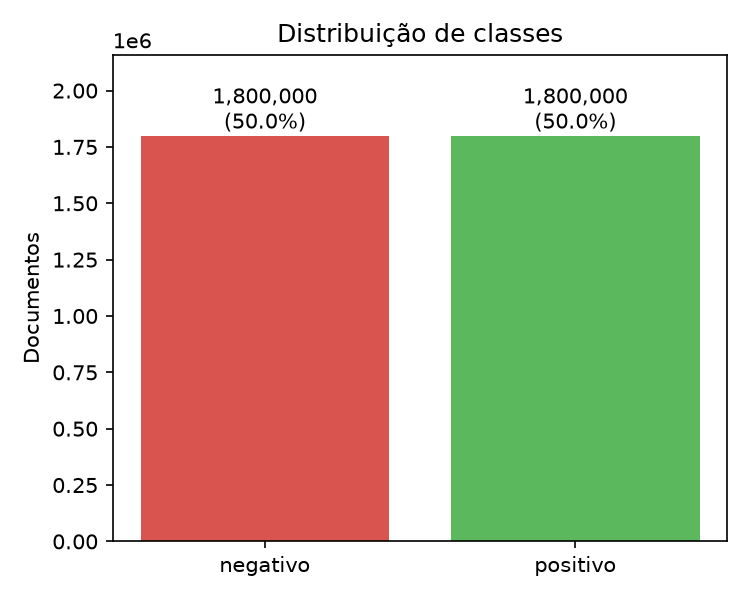

*Figura 1 — Distribuição de classes no conjunto de treino.*

O conjunto é **perfeitamente balanceado**: 1.800.000 documentos por classe no treino e 200.000 no teste (`outputs/eda/classes_test.png`). Como discutido na Seção 2.1, isso dispensa técnicas de balanceamento. Um classificador trivial, que sempre prevê a mesma classe, teria 50% de acurácia, e esse é o patamar mínimo de comparação para os modelos.

### 3.3 Tamanho dos documentos

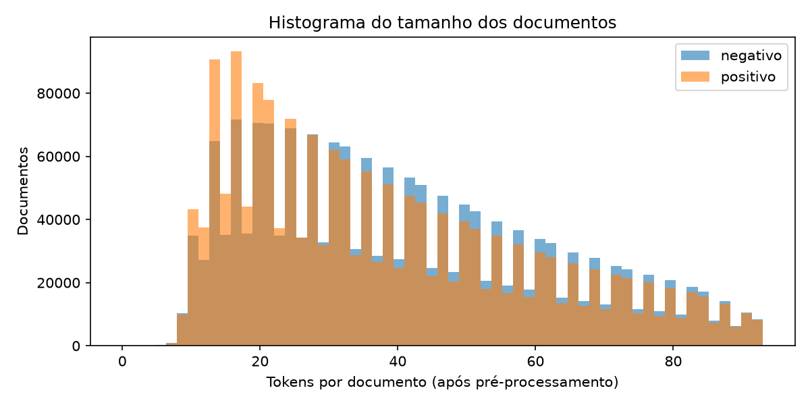

*Figura 2 — Distribuição do número de tokens por documento, por classe (o 1% de documentos mais longos foi omitido para legibilidade).*

As avaliações **positivas são mais curtas**, com média de 38,9 tokens contra 41,3 das negativas e mediana de 34 contra 37:

- **Até ~20 tokens:** 25,3% das positivas e 19,7% das negativas.
- **Acima de 60 tokens:** 19,1% das negativas e 17,1% das positivas.

A interpretação é que o cliente satisfeito tende a escrever um elogio breve ("great product, highly recommend"), enquanto o insatisfeito descreve o problema, a tentativa de uso e a devolução. Há poucos documentos com menos de 8 tokens, já que título e corpo estão sempre presentes.

O padrão alternado de barras altas e baixas é um artefato da largura dos intervalos (~1,6 token), e não uma característica dos dados: alguns intervalos contêm dois valores inteiros de tamanho e outros, apenas um.

### 3.4 Frequência de palavras

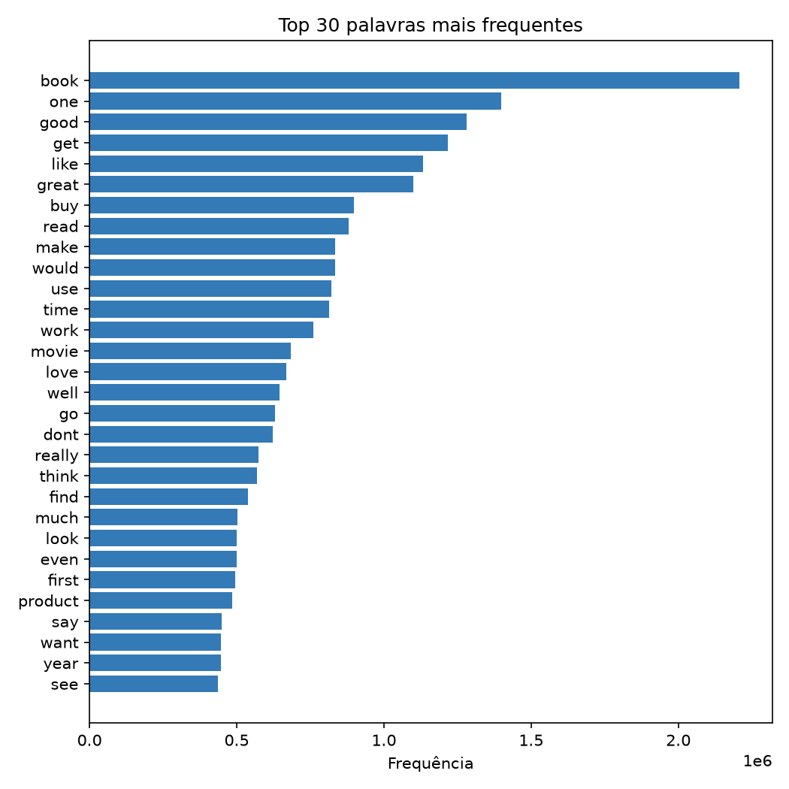

*Figura 3 — As 30 palavras mais frequentes no treino.*

A palavra mais frequente é "book" (2,2 milhões de ocorrências), o que revela que **livros são a categoria dominante** do corpus. "movie" e "product" também estão entre as 30 primeiras. O topo da lista é formado principalmente por:

- verbos genéricos de consumo ("get", "buy", "make", "use", "read");
- palavras de avaliação comuns às duas classes ("good", "like", "great", "love").
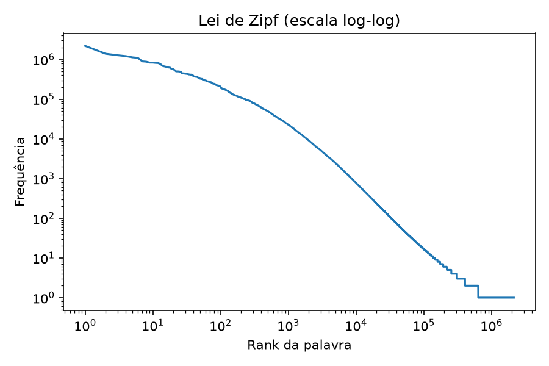

*Figura 4 — Frequência × posição (rank) das palavras, em escala log-log.*

A curva tem o comportamento previsto pela **Lei de Zipf**: a frequência cai aproximadamente como uma potência do rank, o que aparece como uma reta descendente em escala log-log no trecho intermediário. O topo é mais achatado e a cauda, mais íngreme. Os degraus no fim da curva correspondem aos milhões de palavras com frequência entre 1 e 10. O vocabulário é extremamente concentrado:

*Tabela 3 — Fração das ocorrências de tokens coberta pelas palavras mais frequentes (treino).*

| Palavras mais frequentes | 10 | 100 | 1.000 | 10.000 | 50.000 |
|---|---:|---:|---:|---:|---:|
| % das ocorrências | 8,2% | 30,5% | 67,0% | 91,2% | **96,4%** |

Dos 2,14 milhões de termos distintos, **70,2% são hapax**, compostos em grande parte por erros de digitação, palavras coladas e nomes próprios. Essa cauda longa justifica limitar o vocabulário: os 50 mil termos mais frequentes cobrem 96,4% de todas as ocorrências, e o 50.000º termo ainda aparece 50 vezes.

### 3.5 Nuvens de palavras

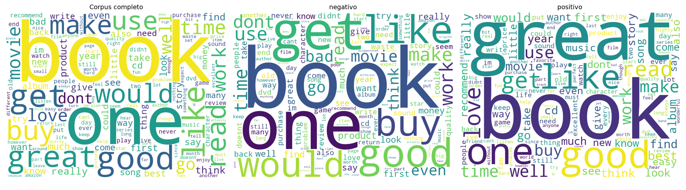

*Figura 5 — Nuvens de palavras do corpus completo, das avaliações negativas e das positivas (150 palavras mais frequentes de cada).*

As três nuvens são dominadas pelas mesmas palavras ("book", "one", "good", "like", "get"), o que mostra que **a frequência bruta discrimina pouco o sentimento**. As diferenças aparecem nas palavras secundárias:

- **Negativas:** "bad", "waste", "money", "return", "dont", "product".
- **Positivas:** "great", "love", "best", "recommend", "excellent", "easy".

Chama atenção que "good" seja a 4ª palavra mais frequente nas avaliações **negativas**, o que reflete construções de contraste ("good idea, but…").

### 3.6 Palavras distintivas de cada classe

Para encontrar as palavras que de fato separam as classes, calculou-se a razão de log-chances (*log-odds ratio*) com suavização de Laplace, para as 5.000 palavras mais frequentes do treino:

$$
\text{log-odds}(w) = \ln\frac{c_{pos}(w) + 1}{N_{pos} + V} - \ln\frac{c_{neg}(w) + 1}{N_{neg} + V}
$$

Aqui, $c_{classe}(w)$ é a contagem da palavra $w$ na classe, $N_{classe}$ é o total de tokens da classe e $V = 5.000$. A restrição às palavras frequentes evita que termos raros, com contagens próximas de zero, dominem o ranking.

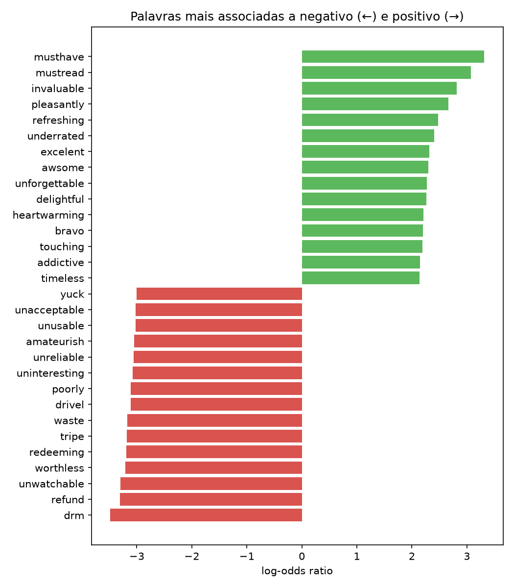

*Figura 6 — As 15 palavras mais associadas a cada classe (log-odds negativo indica associação à classe negativa).*

Diferentemente das nuvens, as palavras distintivas são claramente carregadas de sentimento. Três observações se destacam:

- **Classe negativa.** Aparecem termos de rejeição ("worthless", "unwatchable", "drivel", "tripe", "waste"), de defeito ("unusable", "unreliable", "poorly") e de pós-venda ("refund"). "drm" lidera o ranking e reflete reclamações contra restrições de cópia em mídias digitais.
- **Classe positiva.** Aparecem elogios ("delightful", "heartwarming", "unforgettable", "invaluable"). Os dois primeiros, "musthave" e "mustread", provavelmente são artefatos das palavras coladas ("must-have", "must-read") e acabaram muito discriminativos. Os erros "excelent" e "awsome" indicam escrita entusiasmada e informal.
- **Assimetria.** As palavras negativas mais fortes têm |log-odds| entre 3,0 e 3,5, contra 2,1 a 3,3 das positivas. Termos como "refund" e "unwatchable" quase nunca aparecem em avaliações positivas, enquanto o vocabulário positivo ("great", "good") também é usado nas negativas, em construções de contraste.

### 3.7 Conversão para dataset numérico

Os documentos foram convertidos em duas representações esparsas, usadas tanto nas aplicações não supervisionadas quanto na classificação (`assets/model_inputs/`):

- **Bag-of-Words (BoW).** `CountVectorizer` com vocabulário fixo nos **50.000 termos mais frequentes do treino**. O texto já está tokenizado, então o separador é o espaço (`str.split`), o que evita que o `token_pattern` padrão do scikit-learn descarte tokens de uma letra.
- **TF-IDF.** `TfidfTransformer` com TF sublinear e normalização L2 por documento:

$$
\text{tf}(t,d) = 1 + \ln c(t,d), \qquad \text{idf}(t) = \ln\frac{1 + n}{1 + \text{df}(t)} + 1
$$

O TF sublinear atenua palavras repetidas muitas vezes no mesmo documento. Tanto o **vocabulário quanto o IDF são calculados somente com o treino**, para que nenhuma informação do teste vaze para o modelo.

*Tabela 4 — Dimensões do dataset numérico.*

| Partição | Documentos | Termos | Valores não nulos | Densidade | Termos distintos por doc |
|---|---:|---:|---:|---:|---:|
| Treino | 3.600.000 | 50.000 | 117.253.670 | 0,065% | 32,6 |
| Teste | 400.000 | 50.000 | 13.020.773 | 0,065% | 32,6 |

As matrizes são **extremamente esparsas**: cada documento usa em média 32,6 dos 50.000 termos. O formato esparso (CSR) é indispensável, já que uma matriz densa de treino em `float32` ocuparia cerca de 720 GB.

A Tabela 5 mostra parte de um documento negativo do treino ("Nothing you don't already know: [...] do not waste your money, seriously!!") nas duas representações. Ela ilustra como o TF-IDF reduz o peso de palavras comuns ("book", de IDF baixo) e destaca termos raros e específicos ("apply", "seriously"). A amostra completa, em formato legível, está em `assets/model_inputs/example/` (`bow.csv`, `tfidf.csv` e `esparso.csv`).

*Tabela 5 — Valores BoW e TF-IDF de alguns termos de um documento (doc 34 do treino).*

| Termo | Contagem (BoW) | TF sublinear | IDF | TF-IDF (normalizado) |
|---|---:|---:|---:|---:|
| book | 1 | 1,000 | 2,324 | 0,113 |
| dont | 1 | 1,000 | 2,923 | 0,143 |
| waste | 1 | 1,000 | 3,969 | 0,194 |
| already | 2 | 1,693 | 4,714 | 0,389 |
| seriously | 1 | 1,000 | 5,966 | 0,291 |
| apply | 1 | 1,000 | 6,268 | 0,306 |

### 3.8 Aplicações de aprendizado não supervisionado

Foram exploradas três aplicações sobre o dataset numérico, todas na mesma amostra aleatória de **100.000 documentos de treino** (TF-IDF, 49.912 negativos e 50.088 positivos). A amostragem foi necessária porque t-SNE e silhouette têm custo quadrático no número de pontos, e 100 mil documentos bastam para revelar a estrutura do corpus.

**Etapa comum: LSA.** Antes da visualização e da clusterização, a dimensionalidade foi reduzida com Análise Semântica Latente (LSA): `TruncatedSVD` com 100 componentes, seguido de normalização L2, de modo que a distância euclidiana passe a refletir a similaridade de cosseno entre documentos. Os 100 componentes explicam apenas **12,4% da variância**, o que confirma que a informação do texto está espalhada por muitas dimensões.

#### 3.8.1 Aplicação 1 — Visualização com t-SNE

O t-SNE (perplexidade 30, inicialização por PCA) projetou em duas dimensões a representação LSA de 5.000 documentos da amostra.

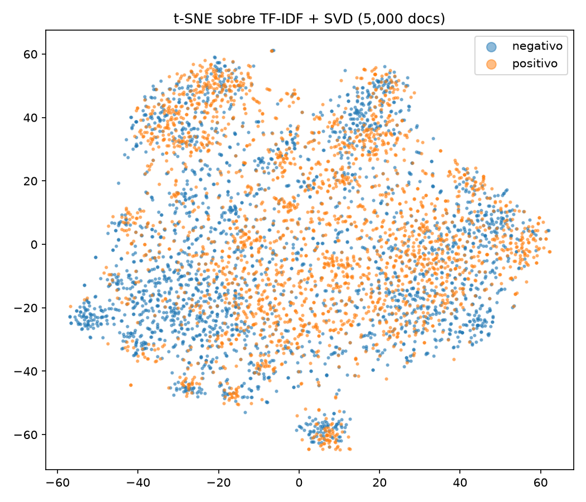

*Figura 7 — Projeção t-SNE de 5.000 documentos (TF-IDF + LSA), coloridos pela classe real.*

As classes **não formam grupos separados**: a projeção mostra uma massa central com algumas ilhas compactas. Essas ilhas são mistas, provavelmente grupos de documentos sobre um mesmo tipo de produto, com avaliações positivas e negativas. Na massa central há regiões com predominância de uma das classes, mas sem fronteira nítida.

A estrutura geométrica mais forte do TF-IDF é, portanto, o **assunto** da avaliação, e não o sentimento. O sentimento está presente, mas como um sinal secundário, distribuído em poucas palavras de cada documento.

#### 3.8.2 Aplicação 2 — Clusterização com K-Means

Aplicou-se o `MiniBatchKMeans` sobre a representação LSA, variando o número de grupos de *k* = 2 a 10. A escolha de *k* usou o coeficiente de silhouette, e o resultado foi comparado com as classes reais pelo Índice de Rand Ajustado (ARI).

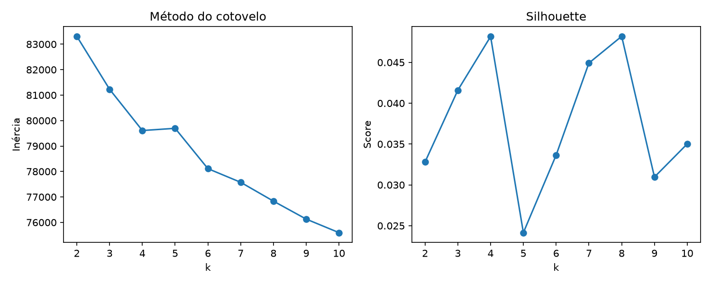

*Figura 8 — Inércia (método do cotovelo) e coeficiente de silhouette em função de k.*

O método do cotovelo não mostra um ponto de inflexão claro: a inércia cai de forma quase contínua. O silhouette é **muito baixo para todos os k** (entre 0,024 e 0,048), e o máximo é praticamente um empate entre *k* = 4 (0,04817) e *k* = 8 (0,04819). Esses valores indicam grupos muito sobrepostos, sem uma partição natural forte. Foi escolhido *k* = 8, o que rende grupos mais finos e mais interpretáveis.

No modelo final (10 inicializações), o silhouette ficou em 0,038 e o **ARI em 0,007**. Ou seja, a partição encontrada é praticamente independente do sentimento.

*Tabela 6 — Grupos encontrados pelo K-Means (k = 8). A categoria é uma interpretação a partir dos termos centrais.*

| Grupo | Documentos | % negativos | Termos mais representativos | Categoria interpretada |
|---:|---:|---:|---|---|
| 0 | 10.091 | 43,6% | story, book, read, character, novel, write, author | livros (enredo) |
| 1 | 10.809 | 42,5% | dvd, watch, show, film, love, video, season | DVDs e séries |
| 2 | 9.365 | 58,6% | work, use, product, great, buy, get, well | produtos (funcionamento) |
| 3 | 11.999 | 36,8% | cd, album, song, music, listen, sound | música |
| 4 | 18.295 | 46,7% | book, read, good, one, write, great, author | livros (geral) |
| 5 | 24.586 | 53,3% | use, product, good, buy, get, great, price | produtos (geral) |
| 6 | 7.510 | 52,5% | movie, watch, see, film, good, bad | filmes |
| 7 | 7.345 | **73,8%** | game, money, waste, buy, dont, play | jogos e "dinheiro desperdiçado" |

O K-Means agrupa os documentos por **categoria de produto**, o que confirma a leitura do t-SNE. A exceção é o grupo 7, com 73,8% de avaliações negativas. Ele reúne jogos e reclamações de compra ("money", "waste", "dont"), sinal de que o vocabulário de arrependimento é coeso o bastante para atrair seu próprio grupo. Também há uma tendência positiva em música (grupo 3, 63% positivas) e negativa em produtos que "não funcionam" (grupo 2).

#### 3.8.3 Aplicação 3 — Modelagem de tópicos com NMF

A Fatoração de Matrizes Não Negativas (NMF, inicialização `nndsvd`) foi aplicada diretamente sobre o TF-IDF, que é não negativo, extraindo **10 tópicos**. Cada documento foi atribuído ao seu tópico dominante (maior peso na matriz W), e a Tabela 7 mostra a proporção dos documentos de cada classe por tópico.

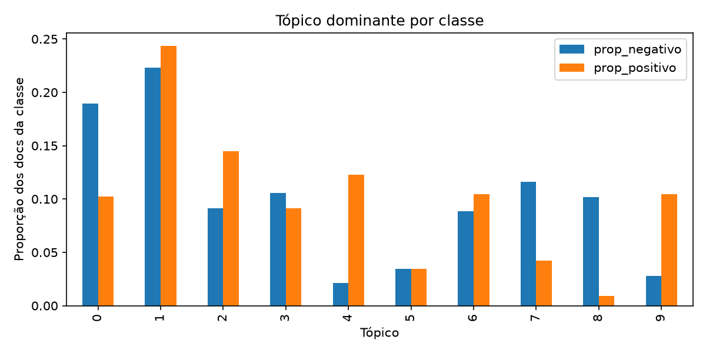

*Figura 9 — Proporção dos documentos de cada classe cujo tópico dominante é t.*

*Tabela 7 — Tópicos NMF e sua distribuição por classe. O rótulo é uma interpretação a partir dos termos.*

| Tópico | Termos mais representativos | Rótulo interpretado | % dos negativos | % dos positivos |
|---:|---|---|---:|---:|
| 0 | work, use, get, one, go, try, make, month, time | uso e falhas do produto | **19,0%** | 10,2% |
| 1 | book, read, story, write, author, character, page | livros | 22,3% | 24,4% |
| 2 | cd, song, album, music, listen, sound, band | música | 9,2% | 14,5% |
| 3 | movie, watch, see, film, dvd, bad, funny | filmes | 10,6% | 9,1% |
| 4 | great, price, easy, recommend, excellent, highly, perfect | **elogio e recomendação** | 2,1% | **12,3%** |
| 5 | game, play, fun, graphic, player, level | jogos | 3,5% | 3,5% |
| 6 | good, like, really, much, quality, look, pretty, price | avaliação moderada | 8,8% | 10,5% |
| 7 | product, order, item, receive, purchase, amazon, return | **pedido, entrega e devolução** | **11,6%** | 4,2% |
| 8 | money, waste, dont, buy, time, bad, worth, save | **dinheiro desperdiçado** | **10,2%** | 0,9% |
| 9 | love, old, year, daughter, kid, gift, christmas | presentes e família | 2,8% | **10,5%** |

Dos três métodos, o NMF foi o que melhor separou os dois eixos do corpus:

- **Tópicos de domínio** (1 livros, 3 filmes, 5 jogos) têm distribuição semelhante nas duas classes.
- **Tópicos de experiência** são fortemente polarizados:
  - o tópico 8 ("dinheiro desperdiçado") é **11 vezes** mais frequente entre as negativas;
  - o tópico 7 (problemas de pedido e devolução), quase 3 vezes;
  - os tópicos 4 (elogio e recomendação) e 9 (presentes) são, respectivamente, 6 e 4 vezes mais frequentes entre as positivas.

Esse resultado mostra que o sentimento é recuperável a partir de combinações de palavras, o que é promissor para os classificadores lineares da próxima etapa.

#### 3.8.4 Comparação das aplicações

*Tabela 8 — Resumo das aplicações não supervisionadas.*

| Aplicação | Técnica | Entrada | Principal resultado | Relação com o sentimento |
|---|---|---|---|---|
| Visualização | LSA + t-SNE | 5.000 docs, 100 dimensões | Ilhas por assunto, classes misturadas | Fraca: regiões com predominância, sem fronteira |
| Clusterização | LSA + MiniBatchKMeans | 100.000 docs, 100 dimensões | 8 grupos por categoria de produto; silhouette ≤ 0,05 | Quase nula (ARI = 0,007), exceto o grupo "waste money" |
| Tópicos | NMF | 100.000 docs, 50.000 termos | 10 tópicos interpretáveis de domínio e de experiência | Forte em tópicos de experiência (4, 7, 8, 9) |

### 3.9 Síntese da análise exploratória

1. **Classes balanceadas e partições consistentes.** Não é preciso tratar desbalanceamento, e o teste representa bem o treino.
2. **O assunto domina a estrutura do texto.** Métodos não supervisionados baseados em distância (t-SNE e K-Means) organizam os documentos por categoria de produto, não por sentimento. A separação das classes exigirá aprendizado supervisionado.
3. **Há sinal lexical claro de sentimento.** O log-odds e os tópicos NMF mostram palavras e combinações fortemente polarizadas, o que favorece modelos lineares sobre BoW e TF-IDF.
4. **Cauda longa e ruído.** 70% do vocabulário são hapax, em grande parte erros de digitação. O corte em 50 mil termos preserva 96,4% das ocorrências.
5. **Fontes prováveis de erro.** Avaliações com contraste ("good, but…"), ironia e avaliações curtas com pouca evidência lexical.

---

## 4. Construção dos modelos de classificação

### 4.1 Modelos escolhidos

Foram escolhidos dois modelos de naturezas diferentes: um **generativo** (Naive Bayes) e um **discriminativo** (SVM linear). Ambos são referências clássicas em classificação de texto e escalam para milhões de documentos esparsos.

**Naive Bayes Multinomial.** O Naive Bayes Multinomial modela cada classe como uma distribuição multinomial sobre as palavras e supõe que as ocorrências são independentes dado a classe. A previsão é:

$$
\hat{c} = \arg\max_{c} \Big[\ln P(c) + \sum_{w} x_w \ln \hat\theta_{c,w}\Big], \qquad \hat\theta_{c,w} = \frac{N_{c,w} + \alpha}{N_c + \alpha\,|V|}
$$

Aqui, $x_w$ é a contagem da palavra no documento, $N_{c,w}$ é a contagem da palavra na classe e $\alpha$ é o parâmetro de suavização. O modelo foi escolhido por quatro motivos:

- é o *baseline* clássico de classificação de texto;
- o treino se resume a contar palavras por classe, em uma única passagem pelos dados;
- trabalha naturalmente com as contagens do BoW;
- seus parâmetros são diretamente interpretáveis.

Preferiu-se a variante multinomial à de Bernoulli, que só considera presença ou ausência de cada palavra, porque a multinomial aproveita a frequência dos termos e costuma ser superior em textos com dezenas de palavras (McCallum; Nigam, 1998). A natureza binária da tarefa não favorece a variante de Bernoulli: "multinomial" e "Bernoulli" descrevem como os **atributos** são modelados, e não quantas classes existem.

**SVM linear.** O SVM linear (`LinearSVC`) encontra o hiperplano de máxima margem entre as classes, minimizando a perda *hinge* quadrática com regularização L2:

$$
\min_{\mathbf{w},\,b}\ \frac{1}{2}\lVert\mathbf{w}\rVert^2 + C\sum_{i}\max\!\big(0,\ 1 - y_i(\mathbf{w}^\top\mathbf{x}_i + b)\big)^2
$$

O hiperparâmetro $C$ controla o compromisso entre margem e erro de treino: quanto menor, mais forte a regularização. O modelo foi escolhido por três motivos:

- textos em alta dimensão e esparsos tendem a ser quase linearmente separáveis, e o SVM linear é um dos classificadores clássicos mais fortes para texto (Joachims, 1998);
- aprende os pesos de todas as palavras **conjuntamente**, sem a suposição de independência do Naive Bayes;
- o solver `liblinear` (Fan et al., 2008) treina com milhões de documentos em minutos.

SVMs com kernel não lineares foram descartados, porque seu custo cresce com o quadrado do número de documentos, o que é inviável para 3,6 milhões.

### 4.2 Representação das features

Cada modelo foi treinado com as duas representações descritas na Seção 3.7, totalizando **4 combinações**:

- **BoW:** contagens brutas dos 50 mil termos (`CountVectorizer`).
- **TF-IDF:** TF sublinear, IDF do treino e normalização L2.

A hipótese inicial era que o Naive Bayes se adaptaria melhor ao BoW, já que seu modelo probabilístico supõe contagens, e o SVM ao TF-IDF, que coloca todos os documentos na mesma escala.

### 4.3 Treinamento e validação

O protocolo usa os **conjuntos completos**: os 3,6 milhões de documentos de treino para escolher hiperparâmetros e treinar, e os 400 mil de teste exclusivamente para a avaliação final (Seção 5).

- **Busca de hiperparâmetros.** `GridSearchCV` com validação cruzada estratificada de 3 partições (`StratifiedKFold`, embaralhada, semente 42) sobre o treino completo, otimizando o **F1 macro**.
- **Grades.** Para o Naive Bayes, $\alpha \in \{0{,}1;\ 0{,}5;\ 1{,}0\}$. Para o SVM, $C \in \{0{,}01;\ 0{,}1;\ 1{,}0\}$.
- **Re-treino.** A melhor configuração de cada combinação é re-treinada no treino completo (`refit=True`) e só então aplicada ao teste.
- **Número de partições.** Cada partição de validação tem 1,2 milhão de documentos, o que já torna as estimativas muito estáveis (desvio-padrão da ordem de 10⁻⁴). Mais partições multiplicariam o custo sem ganho de precisão.
- **Paralelismo.** Foram usados apenas 2 treinos simultâneos (`n_jobs=2`), porque cada processo paralelo recebe uma cópia da matriz de treino (~3 GB) e a máquina tem 15,7 GB de RAM.

O núcleo do treinamento, em `3_model_selection.py`, é:

```python
MODELS = {
    "naive_bayes": (MultinomialNB(), {"alpha": [0.1, 0.5, 1.0]}),
    "svm": (LinearSVC(random_state=42), {"C": [0.01, 0.1, 1.0]}),
}
cv = StratifiedKFold(n_splits=3, shuffle=True, random_state=42)
for rep in ["bow", "tfidf"]:
    X_train, X_test = load(rep, "train"), load(rep, "test")
    for name, (estimator, grid) in MODELS.items():
        search = GridSearchCV(estimator, grid, scoring="f1_macro", cv=cv, n_jobs=2)
        search.fit(X_train, y_train)  # validação cruzada + re-treino no treino completo
        pred = search.best_estimator_.predict(X_test)
```

A etapa completa, com validação cruzada, re-treino, avaliação e análise de erros, levou **cerca de 38 minutos**, dominados pela validação cruzada do SVM.

### 4.4 Resultados da validação cruzada

*Tabela 9 — F1 macro médio na validação cruzada (3 partições) para cada hiperparâmetro. Em negrito, o valor escolhido.*

| Modelo | Representação | Hiperparâmetro | Valor 1 | Valor 2 | Valor 3 |
|---|---|---|---:|---:|---:|
| Naive Bayes | BoW | α = 0,1 / 0,5 / 1,0 | 0,84366 | **0,84367** | 0,84367 |
| Naive Bayes | TF-IDF | α = 0,1 / 0,5 / 1,0 | 0,84010 | 0,84040 | **0,84070** |
| SVM | BoW | C = 0,01 / 0,1 / 1,0 | **0,89306** | 0,89168 | 0,89077 |
| SVM | TF-IDF | C = 0,01 / 0,1 / 1,0 | 0,89055 | **0,89463** | 0,89340 |

O desvio-padrão entre as partições ficou abaixo de 0,0004 em todos os casos.

- **Naive Bayes.** É praticamente **insensível a α**: as diferenças aparecem só na quinta casa decimal. Com milhões de documentos, as contagens de quase todos os termos do vocabulário são grandes, e a suavização só afeta palavras raras.
- **SVM com BoW.** Prefere regularização forte (C = 0,01, o menor valor da grade). As contagens brutas não são normalizadas, então documentos longos têm vetores de norma maior, e um C menor compensa essa escala.
- **SVM com TF-IDF.** O ótimo é interior (C = 0,1), o que indica que a grade cobriu bem a região relevante.

Em dois casos o melhor valor ficou na borda da grade (C = 0,01 no SVM com BoW e α = 1,0 no Naive Bayes com TF-IDF). Ampliar a grade nesses pontos poderia render pequenos ganhos (Seção 5.7).

---

## 5. Avaliação quantitativa dos resultados

### 5.1 Comparação geral no teste

*Tabela 10 — Desempenho no conjunto de teste completo (400.000 documentos), ordenado por F1 macro. Precisão, recall e F1 são médias macro. O tempo é o do re-treino final no treino completo.*

| Modelo | Representação | Hiperparâmetro | F1 (validação) | Acurácia | Precisão | Recall | F1 | Tempo de treino |
|---|---|---|---:|---:|---:|---:|---:|---:|
| **SVM** | **TF-IDF** | C = 0,1 | 0,8946 | **0,8951** | **0,8951** | **0,8951** | **0,8950** | 74,5 s |
| SVM | BoW | C = 0,01 | 0,8931 | 0,8934 | 0,8935 | 0,8934 | 0,8934 | 188,4 s |
| Naive Bayes | BoW | α = 0,5 | 0,8437 | 0,8435 | 0,8435 | 0,8435 | 0,8435 | 0,4 s |
| Naive Bayes | TF-IDF | α = 1,0 | 0,8407 | 0,8403 | 0,8403 | 0,8403 | 0,8402 | 0,6 s |

Todos os modelos ficam muito acima do patamar trivial de 50%. O **melhor é o SVM com TF-IDF**, com F1 de 0,8950 e acurácia de 89,5%. Comparado ao melhor Naive Bayes (BoW, 84,4%), ele erra 41.980 documentos contra 62.609, ou seja, **33% menos erros**.

O F1 da validação cruzada prevê o F1 do teste com diferença inferior a 0,001 em todas as combinações, o que confirma a ausência de sobreajuste na escolha dos hiperparâmetros e a semelhança entre as distribuições de treino e teste (Seção 3.1).

Em custo, a relação se inverte: o Naive Bayes treina em menos de 1 segundo, centenas de vezes mais rápido que o SVM.

### 5.2 Métricas por classe

*Tabela 11 — Precisão, recall e F1 por classe no teste (200.000 documentos por classe).*

| Modelo | Representação | Classe | Precisão | Recall | F1 |
|---|---|---|---:|---:|---:|
| Naive Bayes | BoW | negativo | 0,8390 | 0,8501 | 0,8445 |
| Naive Bayes | BoW | positivo | 0,8481 | 0,8368 | 0,8424 |
| Naive Bayes | TF-IDF | negativo | 0,8349 | 0,8482 | 0,8415 |
| Naive Bayes | TF-IDF | positivo | 0,8457 | 0,8323 | 0,8390 |
| SVM | BoW | negativo | 0,8999 | 0,8853 | 0,8926 |
| SVM | BoW | positivo | 0,8871 | 0,9016 | 0,8943 |
| SVM | TF-IDF | negativo | 0,8986 | 0,8906 | 0,8946 |
| SVM | TF-IDF | positivo | 0,8915 | 0,8996 | 0,8955 |

Os dois modelos têm vieses leves e opostos:

- **Naive Bayes:** reconhece melhor as avaliações **negativas** (recall de 0,850 contra 0,837).
- **SVM:** reconhece melhor as **positivas** (recall de 0,902 contra 0,885 com BoW).

Com TF-IDF, o SVM fica mais equilibrado, com recall de 0,891 para negativas e 0,900 para positivas. Em todos os casos a diferença entre as classes é de no máximo 1,6 ponto percentual, coerente com o conjunto balanceado.

### 5.3 Matrizes de confusão

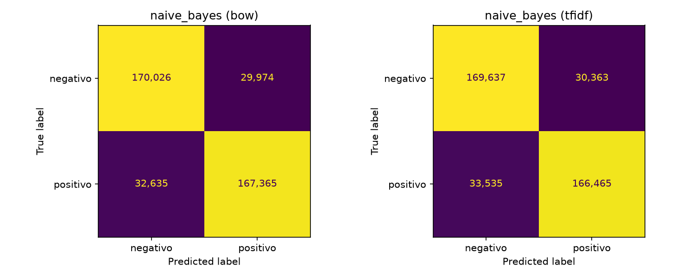

*Figura 10 — Matrizes de confusão do Naive Bayes no teste (BoW à esquerda, TF-IDF à direita).*

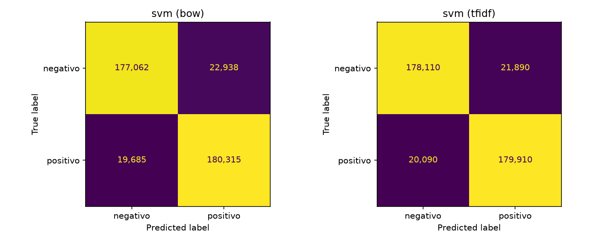

*Figura 11 — Matrizes de confusão do SVM no teste (BoW à esquerda, TF-IDF à direita).*

As matrizes tornam visíveis os vieses da Seção 5.2:

| Modelo e representação | Positivos classificados como negativos (falsos negativos) | Negativos classificados como positivos (falsos positivos) | Erros no total |
|---|---:|---:|---:|
| Naive Bayes, BoW | 32.635 | 29.974 | 62.609 |
| Naive Bayes, TF-IDF | 33.535 | 30.363 | 63.898 |
| SVM, BoW | 19.685 | 22.938 | 42.623 |
| SVM, TF-IDF | 20.090 | 21.890 | 41.980 |

O Naive Bayes erra mais classificando positivos como negativos. O SVM erra mais no sentido oposto. A passagem de BoW para TF-IDF reduz principalmente os falsos positivos do SVM (de 22.938 para 21.890).

### 5.4 BoW (CountVectorizer) × TF-IDF

*Tabela 12 — Comparação direta entre as representações (diferença = TF-IDF − BoW).*

| Modelo | Métrica | BoW | TF-IDF | Diferença |
|---|---|---:|---:|---:|
| Naive Bayes | F1 (validação) | 0,8437 | 0,8407 | −0,0030 |
| Naive Bayes | Acurácia | 0,8435 | 0,8403 | −0,0032 |
| Naive Bayes | Precisão | 0,8435 | 0,8403 | −0,0032 |
| Naive Bayes | Recall | 0,8435 | 0,8403 | −0,0032 |
| Naive Bayes | F1 | 0,8435 | 0,8402 | −0,0032 |
| Naive Bayes | Tempo de treino (s) | 0,42 | 0,58 | +0,15 |
| SVM | F1 (validação) | 0,8931 | 0,8946 | +0,0016 |
| SVM | Acurácia | 0,8934 | 0,8951 | +0,0016 |
| SVM | Precisão | 0,8935 | 0,8951 | +0,0015 |
| SVM | Recall | 0,8934 | 0,8951 | +0,0016 |
| SVM | F1 | 0,8934 | 0,8950 | +0,0016 |
| SVM | Tempo de treino (s) | 188,4 | 74,5 | −114,0 |

O efeito da representação **depende do modelo**, como previsto na Seção 4.2:

- **Naive Bayes: o TF-IDF piora o resultado (−0,32 ponto).** O modelo multinomial interpreta cada valor como um número de ocorrências. Os pesos fracionários e normalizados do TF-IDF distorcem essa verossimilhança: uma palavra rara com IDF alto passa a "valer" várias ocorrências.
- **SVM: o TF-IDF melhora o resultado (+0,16 ponto) e treina 2,5 vezes mais rápido** (74 s contra 188 s). A normalização L2 coloca todos os documentos na mesma escala, o que melhora o condicionamento do problema de otimização e faz o solver convergir em menos iterações. O IDF, por sua vez, reduz o peso de palavras genéricas como "book" e "one".

As diferenças são pequenas em termos absolutos, mas não são ruído. Com 400 mil documentos de teste, o erro-padrão da acurácia é de cerca de 0,0005, então a diferença do SVM (0,0016) corresponde a mais de 3 erros-padrão, e a do Naive Bayes (0,0032), a mais de 5. As diferenças na validação cruzada têm o mesmo sinal e uma magnitude dez vezes maior que o desvio entre partições.

Mesmo assim, a escolha da representação pesa muito menos que a escolha do modelo: trocar Naive Bayes por SVM vale cerca de 5 pontos, contra 0,2 a 0,3 ponto da troca de representação.

### 5.5 Palavras mais importantes de cada modelo

A Seção 3.6 já havia mostrado o sinal lexical presente no corpus. Os gráficos abaixo mostram quais palavras cada modelo efetivamente usa:

- no **Naive Bayes**, o peso de uma palavra é $\ln\hat\theta_{pos,w} - \ln\hat\theta_{neg,w}$;
- no **SVM**, é o coeficiente $w$ do hiperplano.

Em ambos, um peso positivo favorece a classe positiva.

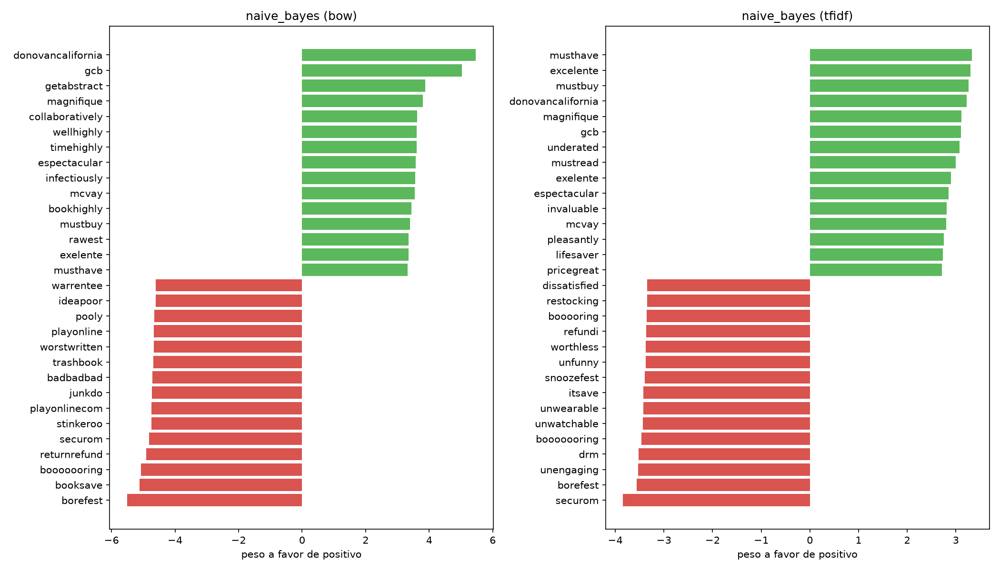

*Figura 12 — As 15 palavras de maior peso para cada classe no Naive Bayes (BoW e TF-IDF).*

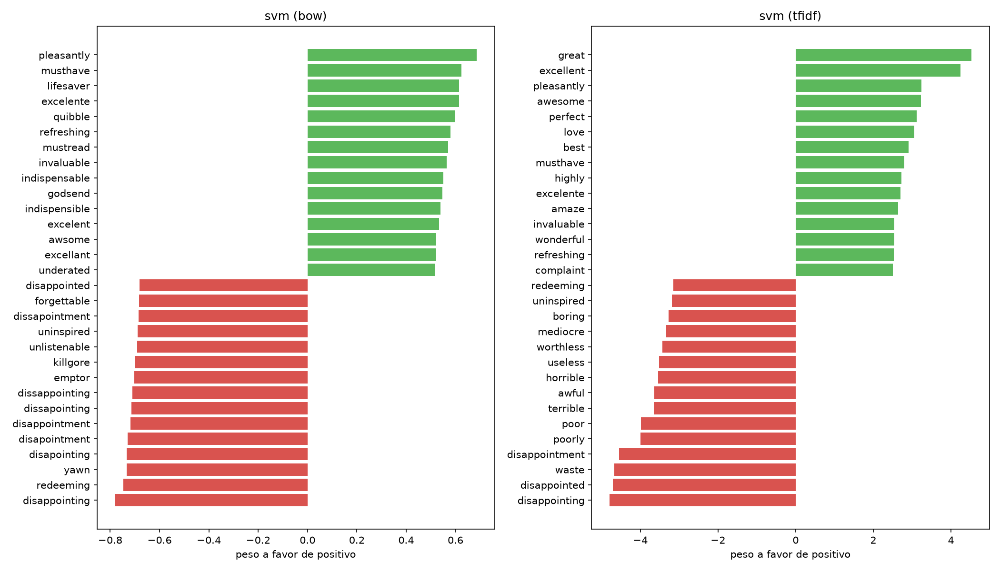

*Figura 13 — As 15 palavras de maior peso para cada classe no SVM (BoW e TF-IDF).*

Os dois modelos aprendem vocabulários de natureza bem diferente:

- **Naive Bayes: termos raros e exclusivos.** O peso do Naive Bayes é uma razão de probabilidades e ignora a frequência da palavra, então os extremos são ocupados por termos raros que aparecem quase só em uma classe:
  - palavras coladas pela remoção de pontuação ("borefest", "returnrefund", "junkdo", "bookhighly", "timehighly");
  - prováveis assinaturas de avaliadores ou nomes próprios ("donovancalifornia", "gcb", "mcvay", "getabstract");
  - software de proteção contra cópia ("securom");
  - palavras em outros idiomas ("excelente", "espectacular", "magnifique").

  Esses termos raramente aparecem no teste e explicam pouco do desempenho, mas mostram que o modelo é sensível a artefatos.
- **SVM com TF-IDF: vocabulário geral.** Os maiores pesos vão para palavras de sentimento frequentes, como "great", "excellent", "love", "perfect" e "best" contra "disappointing", "waste", "poor", "terrible" e "awful". A regularização L2 impede que palavras raras recebam pesos extremos, e a normalização faz com que palavras frequentes de IDF baixo precisem de coeficientes maiores para influenciar a decisão.
- **SVM com BoW: variações ortográficas.** Os extremos incluem várias grafias de "disappointing" ("disapointing", "dissapointing", "dissappointing", "dissapointment"). Como a lematização não corrige erros de digitação, cada variante é aprendida como um atributo separado.
- **Uso contextual.** "complaint" e "quibble" aparecem como **positivas**, porque vêm de expressões como "my only complaint" e "minor quibble", típicas de avaliações favoráveis que apontam um defeito menor.

### 5.6 Análise de erros

**Erro por tamanho do documento.** Os documentos de teste foram divididos em quintis pelo número de tokens que estão no vocabulário, e a taxa de erro foi calculada em cada faixa.

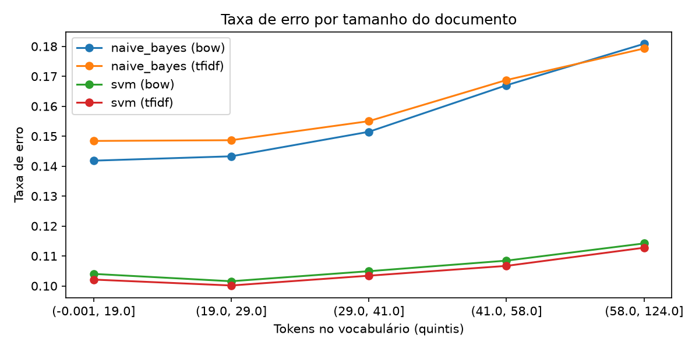

*Figura 14 — Taxa de erro no teste por quintil do tamanho do documento (tokens no vocabulário).*

- **Naive Bayes.** O erro **cresce com o tamanho do documento**: com BoW, vai de 14,2% nos documentos com até 19 tokens para 18,1% nos de 59 a 124 tokens. Pela suposição de independência, o Naive Bayes soma a evidência de cada palavra, de modo que documentos longos acumulam dezenas de termos fracamente polarizados que podem sobrepujar os poucos termos decisivos. Avaliações longas também tendem a ser mistas, com prós e contras. O TF-IDF, com TF sublinear, só ajuda o Naive Bayes no quintil mais longo (17,9% contra 18,1%), onde atenua palavras repetidas.
- **SVM.** É muito mais estável, com erro entre 10,0% e 11,4% em todas as faixas, mínimo entre 20 e 29 tokens. Documentos curtos não são mais difíceis, o que indica que poucas palavras de sentimento bastam quando são inequívocas.

**Erros com maior confiança.** Para cada combinação foram examinados os 10 falsos positivos e os 10 falsos negativos com maior margem de decisão (`erros_exemplos.csv`). A Tabela 13 resume os padrões encontrados.

*Tabela 13 — Padrões nos erros de maior confiança, com exemplos do teste.*

| Padrão | Exemplo (texto original, resumido) | Rótulo real → previsto |
|---|---|---|
| **Rótulo inconsistente com o texto** | "Great!: Got it for my brother. [...] well made. awesome! he enjoyed it" | negativo → positivo (SVM) |
| | "Waste! Worst game ever!: This game is so corny, and cheap! [...]" | positivo → negativo (SVM) |
| **Avaliação mista** | "Great movies, horrible format: The good: the videos themselves are great [...] The bad: [...] this is not a standard DVD" | positivo → negativo (três dos quatro modelos) |
| | "Good, but not great: [...] this 1950 broadcast is wonderful, yes, but there is little humor [...]" | negativo → positivo (SVM) |
| **Vocabulário negativo dirigido a outro produto** | "BUY THIS: This product works great. [...] Do not waste your money on any other products [...] they are horrible." | positivo → negativo (SVM) |
| **Ironia** | "Just like Real Life: [...] showing toddlers how to fire up their first Camel. It makes a perfect companion to the 'My First Martini' gift set" | negativo → positivo (SVM) |
| **Elogio com reclamações técnicas** | "Good Product - Lousy Rebate Service: [...]", "Great Hardware - Weak software and support: [...]" | positivo → negativo (Naive Bayes) |
| **Avaliação em espanhol** | "Un viejo que leia novelas de amor: Es un libro sumamente aburrido [...]" | negativo → positivo (Naive Bayes) |

Três observações se destacam:

1. **Ruído de rótulo.** Boa parte dos erros "confiantes" do SVM é, na verdade, acerto do modelo: textos inequivocamente positivos com rótulo negativo e vice-versa, provavelmente avaliadores que escolheram o número de estrelas errado. Esse ruído impõe um teto ao desempenho alcançável com o dataset.
2. **Avaliações em espanhol.** Os 10 falsos positivos mais confiantes do Naive Bayes, tanto com BoW quanto com TF-IDF, são avaliações negativas em espanhol. Uma busca simples por palavras funcionais espanholas encontra cerca de 570 avaliações nesse idioma no teste (0,14%), das quais 65% são positivas. O Naive Bayes associa as palavras espanholas à classe positiva e, por somar a evidência de dezenas delas como se fossem independentes, chega a margens de até 78 unidades de log-probabilidade. Isso equivale a uma confiança de praticamente 100% em uma previsão errada. O SVM, regularizado, não comete esse erro entre seus casos mais confiantes.
3. **Limitações do BoW.** Contraste ("good, but"), comparação com outros produtos e ironia dependem da ordem e da relação entre as palavras, informação que o BoW e o TF-IDF de unigramas descartam. Isso confirma as fontes de erro antecipadas na Seção 3.9.

### 5.7 Discussão crítica

**Qual modelo performou melhor e por quê.** O **SVM linear com TF-IDF** foi o melhor modelo em todas as métricas, com F1 de 0,895. A superioridade do SVM sobre o Naive Bayes (cerca de 5 pontos) se explica por quatro fatores:

1. **Aprendizado discriminativo e conjunto.** O SVM ajusta os pesos de todas as palavras simultaneamente para separar as classes. Assim, palavras correlacionadas ("waste", "money", "dont") não têm sua evidência contada várias vezes, como ocorre no Naive Bayes.
2. **Regularização.** A penalidade L2 impede que termos raros e artefatos recebam pesos extremos. O Naive Bayes, ao contrário, dá peso máximo a termos raros exclusivos de uma classe (Seção 5.5) e se torna excessivamente confiante (Seção 5.6).
3. **Robustez ao tamanho do documento.** O erro do SVM quase não varia com o tamanho, enquanto o do Naive Bayes sobe quase 4 pontos nos documentos longos.
4. **Representação adequada.** A normalização do TF-IDF favorece o SVM e prejudica o Naive Bayes, cujo modelo pressupõe contagens.

O Naive Bayes, por outro lado, é um *baseline* forte: atinge 84% de acurácia treinando em menos de 1 segundo, contra 74 segundos do SVM.

**Comparação com a literatura.** O resultado é coerente com o publicado para este conjunto de dados. Zhang, Zhao e LeCun (2015) reportam erros da ordem de 10% para modelos lineares com BoW e em torno de 8% com n-gramas. O fastText (Joulin et al., 2017) alcança 91,5% de acurácia com unigramas e 94,6% com bigramas. Os 89,5% obtidos aqui estão na faixa esperada para modelos de unigramas. O ganho dos bigramas na literatura indica que capturar sequências curtas ("waste money", "highly recommend") é o próximo passo mais promissor.

**Limitações e possíveis melhorias.**

| Limitação | Evidência no trabalho | Melhoria proposta |
|---|---|---|
| Somente unigramas | Erros por contraste, comparação e ironia (Seção 5.6) | Incluir bigramas (`ngram_range=(1, 2)`) |
| Pontuação removida sem espaço | Palavras coladas entre os termos de maior peso ("returnrefund", "bookhighly") | Substituir a pontuação por espaço |
| Erros de digitação | Quatro grafias de "disappointing" aprendidas separadamente | Atributos de n-gramas de caracteres ou modelos de subpalavras |
| Ruído de rótulo | Textos inequívocos com rótulo oposto entre os erros mais confiantes | Detectar e revisar rótulos suspeitos, por exemplo pela discordância entre modelos |
| Avaliações em outro idioma | Falsos positivos confiantes do Naive Bayes em espanhol | Detecção de idioma para filtrar ou tratar separadamente |
| Grade de hiperparâmetros restrita | Ótimo na borda da grade (C = 0,01 no SVM com BoW; α = 1,0 no Naive Bayes com TF-IDF) | Ampliar a grade nesses pontos |
| Confiança mal calibrada | Margens de até 78 log-unidades em erros do Naive Bayes | Calibração de probabilidades ou regressão logística, quando probabilidades forem necessárias |

---

## 6. Conclusão

O projeto percorreu o ciclo completo de um problema de PLN sobre 4 milhões de avaliações da Amazon:

- **Pré-processamento:** normalização, remoção de ruído, lematização guiada pela classe gramatical e conversão para BoW e TF-IDF.
- **Análise exploratória:** mostrou um corpus balanceado, estruturado principalmente pelo assunto, mas com sinal lexical claro de sentimento.
- **Classificação:** o SVM linear com TF-IDF atingiu **89,5% de acurácia e F1 de 0,895** no conjunto de teste completo, contra 84,4% do melhor Naive Bayes.

### 6.1 O que mais dificultou o processo?

- **O volume de dados.** Com 3,6 milhões de documentos (1,6 GB), cada decisão de implementação teve consequência prática:
  - a etiquetagem gramatical exigiu processamento paralelo e, ainda assim, levou cerca de 40 minutos;
  - as matrizes precisaram ser esparsas;
  - a validação cruzada foi limitada a 2 processos simultâneos pela memória disponível.

  Cada ciclo completo de experimentação leva quase 1h30, o que restringiu o número de variações testadas.
- **A qualidade do texto.** Erros de digitação, palavras coladas, avaliações em outro idioma e rótulos inconsistentes com o texto apareceram em todas as etapas, das nuvens de palavras aos erros dos modelos.
- **O compromisso do pré-processamento.** Decisões razoáveis isoladamente, como remover a pontuação, tiveram efeitos colaterais, como as palavras coladas, que só ficaram visíveis na análise de erros.
- **A estrutura fraca do não supervisionado.** Os métodos não supervisionados encontraram principalmente o assunto das avaliações, o que exigiu cuidado na interpretação de silhouettes muito baixos e de grupos sem relação com o sentimento.

### 6.2 Quais melhorias poderiam ser implementadas?

- **Dataset:**
  - detectar o idioma e filtrar as avaliações que não estão em inglês;
  - identificar e revisar rótulos suspeitos;
  - remover avaliações duplicadas.
- **Pré-processamento:**
  - substituir a pontuação por espaço em vez de removê-la;
  - normalizar grafias frequentes;
  - avaliar se sinais como "!" e emoticons, hoje descartados, ajudam o modelo.
- **Modelos:**
  - incluir bigramas;
  - ampliar a grade de hiperparâmetros;
  - testar regressão logística, que oferece probabilidades interpretáveis;
  - calibrar as probabilidades.

### 6.3 Como estender o projeto para aplicações reais?

- **Implantação.** O SVM treinado é leve (50 mil pesos) e classifica uma avaliação em microssegundos, o que permite servi-lo como uma API de classificação em tempo real.
- **Monitoramento de reputação.** Acompanhar a proporção de avaliações negativas por produto e por categoria ao longo do tempo.
- **Triagem para atendimento.** Combinar o classificador com os tópicos do NMF para encaminhar avaliações negativas à área responsável. Um exemplo é o tópico de "pedido, entrega e devolução" (logística) contra o de "uso e falhas do produto" (qualidade).
- **Manutenção.** Re-treinar periodicamente e monitorar mudanças no vocabulário (novos produtos e gírias).
- **Avaliação por notas.** Estender para a previsão das 5 estrelas, incluindo as avaliações neutras de 3 estrelas, ausentes deste dataset.

### 6.4 Quais técnicas avançadas poderiam ser aplicadas em uma segunda versão?

- **Representações densas:** embeddings de palavras (word2vec, GloVe) ou fastText com n-gramas, este último com 94,6% de acurácia reportada neste mesmo conjunto.
- **Transformers:** ajuste fino de modelos pré-treinados como BERT ou DistilBERT (Devlin et al., 2019). Eles capturam contraste, ironia e contexto, justamente as principais fontes de erro identificadas, e superam 95% de acurácia em benchmarks de polaridade de avaliações.
- **Análise de sentimento baseada em aspectos:** identificar o sentimento por aspecto (preço, qualidade, entrega) em vez de um rótulo único por avaliação, tratando as avaliações mistas.
- **Explicabilidade:** técnicas como LIME e SHAP para justificar previsões individuais.
- **Modelos multilíngues:** tratar as avaliações em espanhol e em outros idiomas.

---

## 7. Referências

- BIRD, S.; KLEIN, E.; LOPER, E. *Natural Language Processing with Python*. O'Reilly Media, 2009.
- DEVLIN, J. et al. BERT: Pre-training of Deep Bidirectional Transformers for Language Understanding. In: *Proceedings of NAACL-HLT*, p. 4171–4186, 2019.
- DEERWESTER, S. et al. Indexing by Latent Semantic Analysis. *Journal of the American Society for Information Science*, v. 41, n. 6, p. 391–407, 1990.
- FAN, R.-E. et al. LIBLINEAR: A Library for Large Linear Classification. *Journal of Machine Learning Research*, v. 9, p. 1871–1874, 2008.
- HUBERT, L.; ARABIE, P. Comparing partitions. *Journal of Classification*, v. 2, p. 193–218, 1985.
- JOACHIMS, T. Text categorization with Support Vector Machines: learning with many relevant features. In: *European Conference on Machine Learning (ECML)*, p. 137–142, 1998.
- JOULIN, A. et al. Bag of Tricks for Efficient Text Classification. In: *Proceedings of EACL*, p. 427–431, 2017.
- LEE, D. D.; SEUNG, H. S. Learning the parts of objects by non-negative matrix factorization. *Nature*, v. 401, p. 788–791, 1999.
- McCALLUM, A.; NIGAM, K. A comparison of event models for Naive Bayes text classification. In: *AAAI-98 Workshop on Learning for Text Categorization*, 1998.
- PEDREGOSA, F. et al. Scikit-learn: Machine Learning in Python. *Journal of Machine Learning Research*, v. 12, p. 2825–2830, 2011.
- ROUSSEEUW, P. J. Silhouettes: a graphical aid to the interpretation and validation of cluster analysis. *Journal of Computational and Applied Mathematics*, v. 20, p. 53–65, 1987.
- SCULLEY, D. Web-scale k-means clustering. In: *Proceedings of the 19th International Conference on World Wide Web*, p. 1177–1178, 2010.
- VAN DER MAATEN, L.; HINTON, G. Visualizing Data using t-SNE. *Journal of Machine Learning Research*, v. 9, p. 2579–2605, 2008.
- ZHANG, X.; ZHAO, J.; LECUN, Y. Character-level Convolutional Networks for Text Classification. In: *Advances in Neural Information Processing Systems 28 (NIPS)*, 2015.
- ZIPF, G. K. *Human Behavior and the Principle of Least Effort*. Addison-Wesley, 1949.
- Amazon Reviews for Sentiment Analysis. Kaggle. Disponível em: <https://www.kaggle.com/datasets/bittlingmayer/amazonreviews>.
